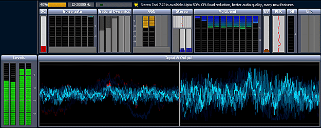
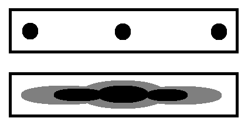
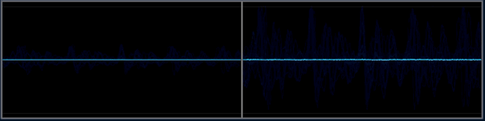
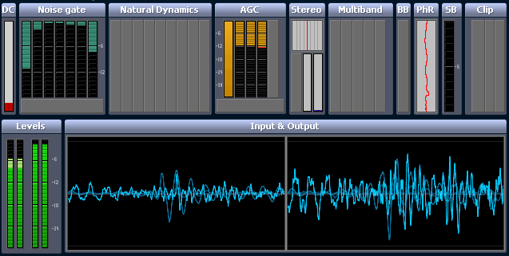
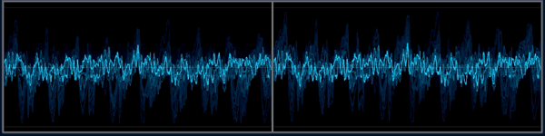
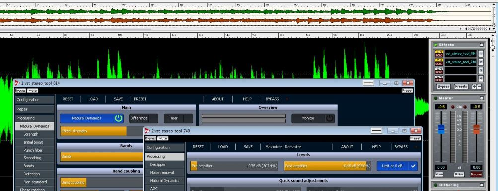

# "Maximizer" Presets (for StereoTool)

Presets for the multiband compressor/limiter <a href="https://www.thimeo.com/stereo-tool" target="_blank">"StereoTool" by Thimeo</a> to enhance, process or manipulate the playback of audio content.

    

## General Rules

* Settings use only the freeware parts of StereoTool (with one exception)
* Clipping is prevented as much as possible (ideal is no clipping at all). I want to keep all the information of the original sound
* A slight stereo width enhancement.
* Best used with StereoTool 7.40 ([download links below](#StereoTool-Download))

## Tipps

- If you experience a strong "pumping" effect it might be the soundcard driver. Some have their own compressor processor active, especially if the equalizer of the soundcard driver is enhancing the bass frequencies. Try to disable the compressor and equalizer of the soundcard driver or reduce the bass enhancement in the active equalizer setting.

## Presets

### Wet

**For Radio/Streaming.**

* Strong autogain and strong multiband compression, very wide stereo width
* designed to enhance the sound like the compressors/limiters do used for radio stations
* compresses the music, keeps it loud as possible without distorting, suitable for all kinds of music recordings/types (classic, jazz, pop, techno, rock, insturmental, live, speech)
* keeps the volume stable (no pumping)
* enhances the "room" of the sound (existing hall, environment sounds)
* enhances bass
* works with already compressed/postprocessed music files (mostly)

### Dry

**For Radio/Streaming.**

*Recommended for freeware use!*

* Strong autogain and slight multiband compression, enhanced stereo width. Keeps more of the original music dynamics. Other than that most like "Wet".

### Golden Punch 

**For Radio/Streaming.**

*Recommended for licenced use!*

* Enhanced "Dry" setting including Declipper and Natural Dynamics. Keeps even more of the original dynamics but also restores distortions due to clipping.

Playlist with tracks/mixes processed using the "Golden Punch" preset:  
https://www.youtube.com/watch?v=MnzICJhoigk&list=PLAD49403BC739FA22

 ### Remaster
 
 **For Mastering before collecting/burning or cleaning older/bad recordings.**
 
 * Special setting for finalizing a music track for release as MP3 or burning on CD. 
 * This setting has no AGC auto gain but uses only the multiband compressor to create the final frequency set: A warm, smooth, clear and clean sound. 
 * Music which is already mixed like that won't change much. 
 * Music with a complete different frequency mix will sometimes change completly. * Slight stereo width enhancement. 
 * Slight overal volume gain on sources with low volume. 
 * Tipp: Use the Pre-Amp-Slider to set the volume for each track individually, so it uses the complete range of the volume but doesnt compress too much - if the tracks appears to be too loud, even turn it down. 
 * To finetune the usage of the full volume range, use the "max amplification" slider of the single band processor.

 ### Plain 
 
 *Experimental* 
 
 * Autogain and slight single band compression, enhanced stereo width. Pretty much makes the sound loud without changing much of the "flavour".

### 60's Stereo

*Experimental*

* Stereo enhancement of the old stereo recordings with 100% channel separation. 
* Mixes the channels, so the instruments don't appear disconnected from each other and the sound uses the whole stereo width. 
* Bass is centered.

Illustration before/after:

    

Recommended tracks to check out the "60s Stereo" preset:

* Frank Sinatra - For Once In My Life
* Frank Sinatra - They Can't Take That Away From Me
* The Beatles - Day Tripper
* The Beatles - Paperback Writer
* The Beatles - Drive My Car
* The Beach Boys - Little Deuce Coupe
* The Beach Boys - Surfer Girl
* Kool and the Gang - Jungle Boogie
* Dusty Springfield - Son of a Preacher Man
* The Statler Brothers - Flowers on the Wall

### Mono2Stereo

*Experimental* 

* Virtual stereo for mono recordings by diffusing the frequencies across the left/right channels. 
* Does only work on pure mono recordings! Stereo recordings will sound weird.

### Oldtimer Radio

*Experimental/Fun* 

* These presets try to recreate the warm, dry sound of a vintage radio from the 1930s/40s with its limits in the upper frequencies.

### Talk Podcasts

*Preparation for portable players*

    

* Special setting for preparing Talk Podcasts (usually badly encoded MP3 with a low volume) for using on a MP3 player. 
* Helps saving energy (low volume setting on the MP3 player) and protecting from environment sounds around headphones by pushing the speaker sounds to the loudest level. 
* Simple settings for fast processing of long podcast MP3s (30-60 minutes) before putting them on the MP3 player. 
* DO NOT USE FOR MUSIC!

### Cleaned Talk Podcast

    

* Preset for a clean Talk Podcast sound
* Needs license! 
* Declips, derumbles, denoises, reduces room reverb (results in a dry sound)
* adds volume to voices
* removes "P" popping
* steady aligned loudness for all voices. 
* DO NOT USE FOR MUSIC!

### Voice Extraction

*Preparation for portable players*

* Quite similar to the "Talk Podcasts" setting, but it tries additionally to filter the voices out of a stereo image and place it in a mono center. 
* Usefull for bad recordings of interview panels with a lot of environment sounds which distract from the voices.

### MOD Files (ProTracker)

*Experimental*

* Special setting for music sources coming from the Amiga ProTracker MOD file format. 
* Strong multiband compression, simulated stereo from 4 channel sound (2 channels left, 2 channels right). 
* DO NOT USE FOR NORMAL MUSIC!

Playlist with examples of MOD sound recordings post processed with this preset (as part of an effects chain including an impulse response convolution reverb processor for further dithering of the crushed 8 bit sample stereo sound): 
https://www.youtube.com/playlist?list=PLmVrW7ctP83c_MeBwxgQYrjlvkN_jcRIA

 ### Offset Fix
 
* Fixes DC offset.
* About: https://manual.audacityteam.org/man/dc_offset.html

    

## StereoTool Download

The presets are best used with StereoTool 7.40:

* DSP: https://www.stereotool.com/download/dsp_stereo_tool_installer_740.exe
* Standalone Installer: https://www.stereotool.com/download/stereo_tool_standalone_installer_740.exe
* Standalone Installer 64-Bit: https://www.stereotool.com/download/stereo_tool_standalone_installer_64_740.exe
* Command line: https://www.stereotool.com/download/stereo_tool_cmd_740.exe
* VST DLL: https://www.stereotool.com/download/vst_stereo_tool_740.dll
* VST DLL 64-Bit: https://www.stereotool.com/download/vst_stereo_tool_64_740.dll
* VST NoSSE2 DLL: https://www.stereotool.com/download/vst_stereo_tool_NoSSE2_740.dll

Versions after 7.40 might produce distortions/clipping due to the usage of the classic multiband compressor/limiter in most of the presets. There seems to be a bug in the voice protection routine of the old multiband processor after 7.40. All versions of Stereotool after this are causing little clipping distortions, especially with piano music. 7.70 has the least clipping distortions, after that it becomes even more prominent. 

Several requests to fix this were unsuccessfull, so these settings will be only compatible until 7.40. 

To use new features you have to set up an effect chain, where the current version of Stereotool comes first (to use the repair options for example) and then Stereotool 7.40 with one of the Maximizer presets comes next:

    

